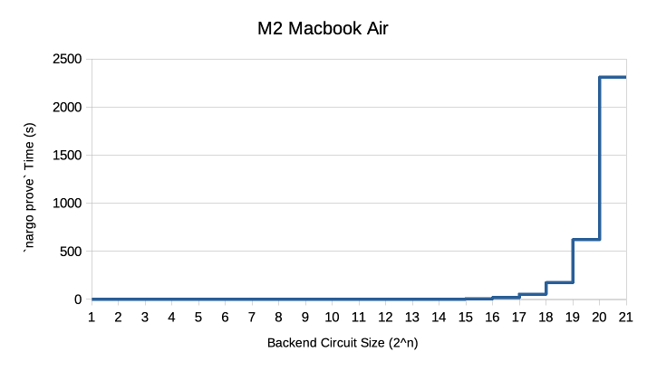

# Noir Benchmarks
Benchmark `nargo prove` times of Noir programs spanning across different constraint counts (i.e. program sizes).

## Results

Existing results were gathered using:
- M2 Macbook Air
- Nargo v0.19.4 (paired with the default [barretenberg](https://github.com/AztecProtocol/aztec-packages/tree/master/barretenberg) proving backend)

| Backend Circuit Size | Time (s) |
|----------------------|----------|
| 2^2                  | 0.476    |
| 2^3                  | 0.479    |
| 2^4                  | 0.471    |
| 2^5                  | 0.492    |
| 2^6                  | 0.504    |
| 2^7                  | 0.517    |
| 2^8                  | 0.514    |
| 2^9                  | 0.592    |
| 2^10                 | 0.606    |
| 2^11                 | 0.718    |
| 2^12                 | 0.879    |
| 2^13                 | 1.257    |
| 2^14                 | 2.002    |
| 2^15                 | 3.679    |
| 2^16                 | 7.921    |
| 2^17                 | 19.549   |
| 2^18                 | 54.928   |
| 2^19                 | 174.689  |
| 2^20                 | 621.208  |
| 2^21                 | 2310.359 |



Detailed results are available in the [`results`](./results/) folder.

## Run it yourself

To gather your own results, [install Nargo](https://noir-lang.org/getting_started/nargo_installation) and run from the project root:

```
bash scripts/info_and_prove_csv.sh
```

You can then find the results being printed into the CSV file under the [`results`](./results/) folder.

**Note:** The first run includes program compilations. Conduct a second run to obtain accurate benchmarks of `nargo prove` times.

### Contribute

If you would like to share results from your local runs, submit a Pull Request specifying:

- Hardware specifications / model
- Nargo version used
- Proving backend used

## 2^n constraint counts

Ultraplonk-based barretenberg comes with stepped proving time and memory footprints per powers of 2 constraint counts. That is two Noir programs of 150,000 and 250,000 backend constraint counts respectively would cost similar time and memory to prove, as they both consists of >2^17 and ≤2^18 constraints.

The repository contains Noir programs of backend constraint counts from 2^2 to 2^24 as of Nargo v0.19.4 and its paired version of barretenberg.

You can run the following command at the project root to verify actual contraint counts of each example program:

```
nargo info --package {package_name e.g. 2^2}
```

You should then see the corresponding details printed to your console:

```
$ nargo info --package 2^2
+---------+------------------------+--------------+----------------------+
| Package | Language               | ACIR Opcodes | Backend Circuit Size |
+---------+------------------------+--------------+----------------------+
| 2^2     | PLONKCSat { width: 3 } | 0            | 5                    |
+---------+------------------------+--------------+----------------------+
```