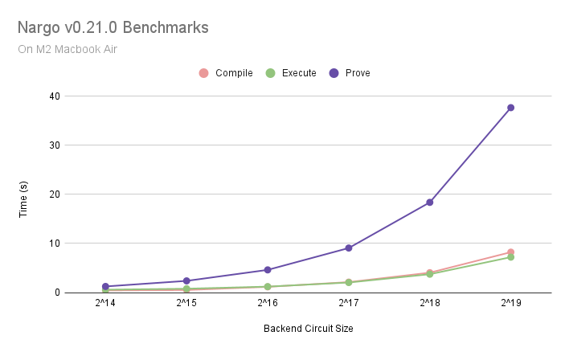

# Noir Benchmarks
Benchmark `nargo prove` times of Noir programs spanning across different constraint counts (i.e. program sizes).

## Results

Existing results were gathered using:
- M1 Max Macbook Pro
- Nargo v0.26.0 paired with the default [barretenberg](https://github.com/AztecProtocol/aztec-packages/tree/master/barretenberg) proving backend

| Primitive                    | Backend Circuit Size | Compile Time (s) | Execute Time (s) | Prove Time (s) | Execute + Prove Time (s) |
|------------------------------|:--------------------:|:----------------:|:----------------:|:--------------:|:------------------------:|
| keccak256_32B                |               54,830 |            0.248 |            0.283 |          1.586 |                    1.869 |
| keccak256_32B_100_times      |            1,829,949 |            0.227 |            0.286 |         36.157 |                   36.443 |
| keccak256_532B               |               97,766 |            0.228 |            0.282 |          2.771 |                    3.053 |
| keccak256_532B_10_times      |              761,974 |            0.256 |            0.354 |         17.475 |                   17.829 |
| ecdsa_secp256k1              |               36,355 |            0.219 |            0.281 |          1.623 |                    1.904 |
| compute_merkle_root_depth_4  |               28,858 |            0.217 |            0.280 |          1.044 |                    1.324 |
| compute_merkle_root_depth_32 |               30,482 |            0.229 |            0.299 |          1.081 |                    1.380 |
| verify_proof                 |              257,427 |            0.219 |            0.291 |          5.262 |                    5.553 |
| storage_proof_depth_8        |            1,686,784 |            0.578 |            1.501 |         34.708 |                   36.209 |




| Backend Circuit Size | Compile Time (s) | Execute Time (s) |        Prove Time (s)       | Execute + Prove Time (s) |
|:--------------------:|:----------------:|:----------------:|:---------------------------:|:------------------------:|
| 2^2                  |            0.317 |            0.405 |                       0.092 |                    0.474 |
| 2^3                  |            0.296 |            0.392 |                       0.062 |                    0.473 |
| 2^4                  |            0.296 |            0.381 |                       0.069 |                    0.474 |
| 2^5                  |            0.297 |            0.381 |                       0.087 |                    0.492 |
| 2^6                  |            0.297 |            0.379 |                       0.097 |                    0.501 |
| 2^7                  |            0.296 |            0.381 |                       0.103 |                     0.51 |
| 2^8                  |            0.298 |            0.379 |                       0.113 |                    0.517 |
| 2^9                  |            0.299 |            0.403 |                        0.14 |                    0.571 |
| 2^10                 |            0.313 |            0.386 |                       0.191 |                    0.614 |
| 2^11                 |            0.321 |            0.408 |                        0.26 |                     0.71 |
| 2^12                 |            0.328 |            0.427 |                       0.415 |                    0.892 |
| 2^13                 |            0.365 |            0.476 |                       0.702 |                    1.218 |
| 2^14                 |            0.436 |            0.596 |                       1.255 |                    1.882 |
| 2^15                 |            0.533 |             0.79 |                       2.389 |                    3.184 |
| 2^16                 |            1.175 |            1.219 |                       4.627 |                    6.362 |
| 2^17                 |            2.137 |            2.054 |                       9.075 |                   12.022 |
| 2^18                 |            4.057 |            3.745 |                      18.368 |                   23.328 |
| 2^19                 |            8.235 |            7.219 |                       37.65 |                   46.248 |
| 2^20                 |           17.365 |           14.188 |                      77.025 |                   92.999 |
| 2^21                 |           36.593 |           28.024 |                     177.603 |                  215.753 |
| 2^22                 |           81.102 |           56.556 | Failed to download g1 data. |                          |
| 2^23                 |           178.06 |             87.2 |                             |                          |
| 2^24                 |          839.978 |          245.025 |                             |                          |

Detailed results are available in the [`results`](./results/) folder.

A Noir user flow typically starts from developers compiling and distributing the compiled artifacts as a part of their applications to users, where users then execute the application and prove their execution. Execute and Prove times combined hence represents what application users are expected to experience when interacting with applications built with Noir.

The "Execute + Prove Time"s above were gathered through running `nargo prove`, which not only does execution and proving but also additional minor tasks that might contribute to the differences between simply summing "Execute" and "Prove" times up.

## Run it yourself

To gather your own results, [install Nargo](https://noir-lang.org/getting_started/nargo_installation) and run from the project root:

```
bash scripts/benchmark_all.sh
```

You can then find the results being printed into the CSV file under the [`results`](./results/) folder.

**Note:** The first run includes program compilations. Conduct a second run to obtain accurate benchmarks of `nargo prove` times.

### Contribute

If you would like to share results from your local runs, submit a Pull Request specifying:

- Hardware specifications / model
- Nargo version used
- Proving backend used

## 2^n constraint counts

Ultraplonk-based barretenberg comes with stepped proving time and memory footprints per powers of 2 constraint counts. That is two Noir programs of 150,000 and 250,000 backend constraint counts respectively would cost similar time and memory to prove, as they both consists of >2^17 and ≤2^18 constraints.

The repository contains Noir programs of backend constraint counts from 2^2 to 2^24 as of Nargo v0.19.4 and its paired version of barretenberg.

You can run the following command at the project root to verify actual contraint counts of each example program:

```
nargo info --package {package_name e.g. 2^2}
```

You should then see the corresponding details printed to your console:

```
$ nargo info --package 2^2
+---------+------------------------+--------------+----------------------+
| Package | Language               | ACIR Opcodes | Backend Circuit Size |
+---------+------------------------+--------------+----------------------+
| 2^2     | PLONKCSat { width: 3 } | 0            | 5                    |
+---------+------------------------+--------------+----------------------+
```